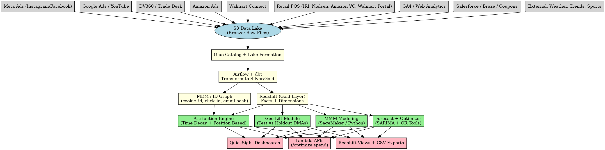

## 📘 Phase 1: Business Context & Problem

###  The Product

A leading consumer packaged goods (CPG) brand is launching a new version of its laundry detergent pods, designed specifically for active lifestyles: targeting gym-goers, athletes, and busy families.

Customers do not purchase this product directly from the brand's website. Instead, they click “Find a Retailer” and are redirected to third-party platforms like Amazon, Walmart, or Target to complete the transaction. This means the brand has **no direct visibility into the checkout process or end purchase behavior.**

---

###  The Campaign

The brand allocated a **$35 million marketing budget** over **12 weeks** to support the launch.

Spend was distributed across:
- **Video ads**: YouTube, Hulu, other Connected TV (CTV)
- **Social media**: Instagram Reels with influencers
- **Search ads**: capturing high-intent queries like “best detergent for gym clothes”
- **Retail Media Networks (RMNs)**: Sponsored listings on Amazon, Walmart, and Target
- **CRM campaigns**: Email campaigns and digital coupons distributed via internal databases

---

###  The Goals

Because the brand doesn’t control the final transaction, it needed to:
- **Prove that ads are driving real retail purchases**, not just online engagement
- **Identify which channels actually influence sales**
- **Forecast regional demand** so that retail partners don’t run out of inventory, or overstock
- **Eliminate wasted ad spend** and reallocate toward top-performing strategies

---

###  The Challenge

After the first month of campaign execution:
- Ads delivered millions of **impressions**, especially on YouTube and Instagram
- **Sales improved** in several regions, particularly in southern U.S. markets
- The agency’s **last-touch reports** highlighted Meta as a top performer
- However, **internal modeling** suggested CTV and YouTube were the real drivers of uplift
- Several retail locations experienced **stock imbalances** (some out-of-stock, others overstocked)

---

###  Why It’s Complicated

- The brand **does not have full-funnel user tracking**, since purchases happen on external retailer platforms
- **Retail data feeds are inconsistent** between partners (Amazon vs. Walmart vs. Target)
- There is no single source of truth to determine **which ads actually led to conversions**

---

###  What Leadership Is Asking

- Which ad channels are **truly influencing purchases**?
- Are we **overspending on retargeting** and **undervaluing CTV or YouTube**?
- What would happen if we **reallocated $5M** across channels?
- How do we **forecast demand by DMA** (Designated Market Area) to support retail partners?
- Can we **prove the campaign worked**, beyond what ad platforms claim?

---

###  Translation of Jargon

| Term | Simple Meaning |
|------|----------------|
| POS (Point of Sale) | Retailer sales data (units sold at Amazon, Walmart, etc.) |
| Impressions | How many times an ad was shown |
| Conversion | A purchase |
| Last-click attribution | Giving credit to the last ad someone clicked |
| Incrementality / Lift | Sales that would not have happened without the ad |
| RMN | Retail Media Network (Amazon Ads, Walmart Connect) |
| Over-frequency | Showing the same ad too often |
| ROAS | Return on Ad Spend (revenue per $1 spent) |
| ROAS_inc | ROAS from *incremental* (causal) sales only |
| Geo holdout test | Turning off ads in some regions to measure impact |
| MMM | Marketing Mix Modeling — a statistical method for estimating channel performance |

---

###  Working Hypotheses

1. **CTV and YouTube are driving true incremental sales** but not getting full credit due to attribution limitations.
2. **Retargeting (Meta/Instagram)** is over-attributed because it's often the last ad a user sees.
3. A **budget shift toward upper-funnel video channels** would improve actual ROI.
4. **Geo-level lift testing** can prove causality even without user-level tracking.
5. **Forecasting demand by region and retailer** will help prevent lost sales and reduce returns due to overstock.
Let me know

#  Retailer-Fulfilled Media Analytics (AWS Reference Project)

An end-to-end, interview-ready reference implementation for **Media Analytics & Attribution** in a **retailer-fulfilled** world (e.g., Customer → Amazon/Walmart/Target).

## What this repo contains
- **SQL schemas** for Redshift
- **dbt starter project** for transforms
- **Python** reference code for MTA, MMM-lite, and forecasting
- **Sample data** to run a local demo
- **Architecture diagram** and Make targets

> This is a skeleton for GitHub. Replace secrets, wire to your real infra, or run locally with sample CSVs.

## Architecture (AWS)
- Sources → S3 Data Lake → Redshift (warehouse) → ML (SageMaker/EMR) → QuickSight/APIs
- Orchestration via Airflow (MWAA) or local cron for demo



## Quickstart (Local demo)
```bash
python -m venv .venv && source .venv/bin/activate
pip install -r requirements.txt

# Run simple demo: loads sample CSVs, applies MTA weights, prints channel credit
python src/ingest/load_sample.py
python src/attribution/mta.py --paths data/sample/paths_sample.csv --out data/sample/attribution_out.csv

# Run MMM-lite demo
python src/modeling/mmm.py --features data/sample/mmm_features_sample.csv --out data/sample/mmm_outputs.json

# Run forecasting demo
python src/forecast/forecast.py --hist data/sample/pos_sales_sample.csv --out data/sample/forecast_out.csv
```

## Repo layout
```
src/
  ingest/        # sample loaders
  transform/     # dbt seeds/hooks (placeholder)
  attribution/   # MTA & geo-lift demo
  modeling/      # MMM-lite (ridge) demo
  forecast/      # SARIMAX/Prophet-style demo
sql/schema/      # Redshift DDL
dbt/             # dbt starter
data/sample/     # synthetic CSVs
diagrams/        # architecture image
docker/          # dockerfile (optional)
```

## Disclaimers
- This is a **teaching** and interview-reference repo; adapt for production.
- Replace sample CSV with your internal feeds and secure secrets.
